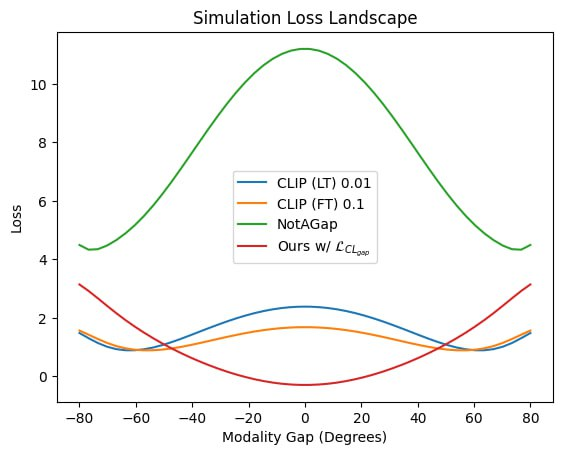

# Rebuttal for paper Building the Perfect Multimodal Latent Space: Aligned Semantics while Closing the Modality Gap

### Plot for Reviewer Tk8Y

Six simulated image-text embedding pairs on a 3D sphere. Text embeddings are shifted towards closing the modality gap, but previous losses are minimized in presence of modality gap (degree around -60 or 60), while the proposed loss is minimized exactly at zero modality gap.

